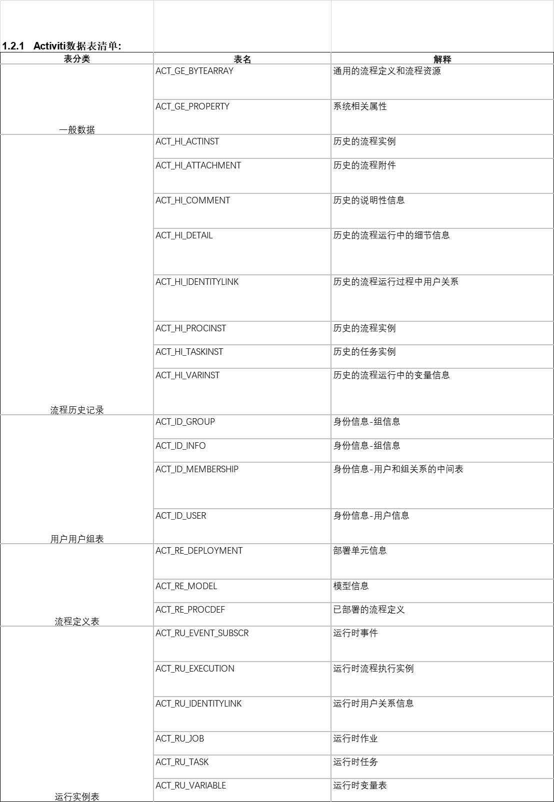

Activiti数据库表结构
1.1      数据库表名说明
Activiti工作流总共包含23张数据表，所有的表名默认以“ACT_”开头。

并且表名的第二部分用两个字母表明表的用例，而这个用例也基本上跟Service API匹配。

u  ACT_GE_* : “GE”代表“General”（通用），用在各种情况下；

u  ACT_HI_* : “HI”代表“History”（历史），这些表中保存的都是历史数据，比如执行过的流程实例、变量、任务，等等。Activit默认提供了4种历史级别：

Ø  none: 不保存任何历史记录，可以提高系统性能；

Ø  activity：保存所有的流程实例、任务、活动信息；

Ø  audit：也是Activiti的默认级别，保存所有的流程实例、任务、活动、表单属性；

Ø  full：最完整的历史记录，除了包含audit级别的信息之外还能保存详细，例如：流程变量。

对于几种级别根据对功能的要求选择，如果需要日后跟踪详细可以开启full。

u  ACT_ID_* : “ID”代表“Identity”（身份），这些表中保存的都是身份信息，如用户和组以及两者之间的关系。如果Activiti被集成在某一系统当中的话，这些表可以不用，可以直接使用现有系统中的用户或组信息；

u  ACT_RE_* : “RE”代表“Repository”（仓库），这些表中保存一些‘静态’信息，如流程定义和流程资源（如图片、规则等）；

u  ACT_RU_* : “RU”代表“Runtime”（运行时），这些表中保存一些流程实例、用户任务、变量等的运行时数据。Activiti只保存流程实例在执行过程中的运行时数据，并且当流程结束后会立即移除这些数据，这是为了保证运行时表尽量的小并运行的足够快；

2  Activiti中主要对象的关系
本节主要介绍在工作流中出现的几个对象及其之间的关系，以及在Activiti中各个对象是如何关联的。

在开始之前先看看下图，对整个对象结构有个了解，再结合实例详细介绍理解。

图1.Activiti中几个对象之间的关系

我们模拟一个请假的流程进行分析介绍，该流程主要包含以下几个步骤：

u  员工申请请假

u  部门领导审批

u  人事审批

u  员工销假

ProcessInstance对象

员工开始申请请假流程，通过runtimeService.startProcessInstance()方法启动，引擎会创建一个流程实例（ProcessInstance）。

简单来说流程实例就是根据一次（一条）业务数据用流程驱动的入口，两者之间是一对一的关系。流程引擎会创建一条数据到ACT_RU_EXECUTION表，同时也会根据history的级别决定是否查询相同的历史数据到ACT_HI_PROCINST表。

启动完流程之后业务和流程已经建立了关联关系，第一步结束。

启动流程和业务关联区别：

u 对于自定义表单来说启动的时候会传入businessKey作为业务和流程的关联属性

u 对于动态表单来说不需要使用businessKey关联，因为所有的数据都保存在引擎的表中

u 对于外部表单来说businessKey是可选的，但是一般不会为空，和自定义表单类似

Execution对象

对于初学者来说，最难理解的地方就是ProcessInstance与Execution之间的关系，要分两种情况说明。Execution的含义就是一个流程实例（ProcessInstance）具体要执行的过程对象。

不过在说明之前先声明两者的对象映射关系：

ProcessInstance（1）→ Execution(N)，（其中N>=1）。

1)  值相等的情况：

除了在流程中启动的子流程之外，流程启动之后在表ACT_RU_EXECUTION中的字段ID_和PROC_INST_ID_字段值是相同的。

图2.ID_和PROC_INST_ID_相等

2)  值不相等的情况：

不相等的情况目前只会出现在子流程中（包含：嵌套、引入），例如一个购物流程中除了下单、出库节点之外可能还有一个付款子流程，在实际企业应用中付款流程通常是作为公用的，所以使用子流程作为主流程（购物流程）的一部分。

当任务到达子流程时引擎会自动创建一个付款流程，但是这个流程有一个特殊的地方，在数据库可以直观体现，如下图。

图3.ID_和PROC_INST_ID_不相等

上图中有两条数据，第二条数据（嵌入的子流程）的PARENT_ID_等于第一条数据的ID_和PROC_INST_ID_，并且两条数据的PROC_INST_ID_相同。

上图中还有一点特殊的地方，字段IS_ACTIVE_的值分别是0和1，说明正在执行子流程主流程挂起。

Task对象

前面说了ProcessInstance和业务是一对一关联的，和业务数据最亲密；而Task则和用户最亲密的（UserTask），用户每天的待办事项就是一个个的Task对象。

从图1中看得出Execution和Task是一对一关系，Task可以是任何类型的Task实现，可以是用户任务（UserTask）、Java服务（JavaServiceTask）等，在实际流程运行中只不过面向对象不同，用户任务(UserTask)需要有人为参与完成（complete），Java服务需要由系统自动执行（execution）。

图4. 表ACT_RU_TASK

Task是在流程定义中看到的最大单位，每当一个Task完成的时候引擎会把当前的任务移动到历史中，然后插入下一个任务插入到表ACT_RU_TASK中。结合请假流程来说就是让用户点击“完成”按钮提交当前任务是的动作，引擎自动根据任务的顺序流或者排他分支判断走向。

HistoryActivity（历史活动）

图5. 表ACT_HI_ACTINST

Activity包含了流程中所有的活动数据，例如开始事件（图5表中的第1条数据）、各种分支（排他分支、并行分支等，图5表中的第2条数据）、以及刚刚提到的Task执行记录（如图5表中的第3、4条数据）。

有些人认为Activity和Task是多对一关系，其实不是，从上图中可以看出来根本没有Task相关的字段。

结合请假流程来说，如Task中提到的当完成流程的时候所有下一步要执行的任务（包括各种分支）都会创建一个Activity记录到数据库中。例如领导审核节点点击“同意”按钮就会流转到人事审批节点，如果“驳回”那就流转到调整请假内容节点，每一次操作的Task背后实际记录更详细的活动（Activity）

任务查询
流程启动后，任务的负责人就可以查询自己当前需要处理的任务，查询出来的任务都是该用户的待办任务。

 流程任务处理
任务负责人查询待办任务，选择任务进行处理，完成任务。
* 查询当前个人待执行的任务
*/
@Test
public void testFindPersonalTaskList() {
//    任务负责人
String assignee = "zhangsan";
ProcessEngine processEngine = ProcessEngines.getDefaultProcessEngine();
//    创建TaskService
TaskService taskService = processEngine.getTaskService();
//    根据流程key 和 任务负责人 查询任务
List<Task> list = taskService.createTaskQuery()
.processDefinitionKey("myEvection") //流程Key
.taskAssignee(assignee)//只查询该任务负责人的任务
.list();
for (Task task : list) {
System.out.println("流程实例id：" + task.getProcessInstanceId());
System.out.println("任务id：" + task.getId());
System.out.println("任务负责人：" + task.getAssignee());
System.out.println("任务名称：" + task.getName());
}
}